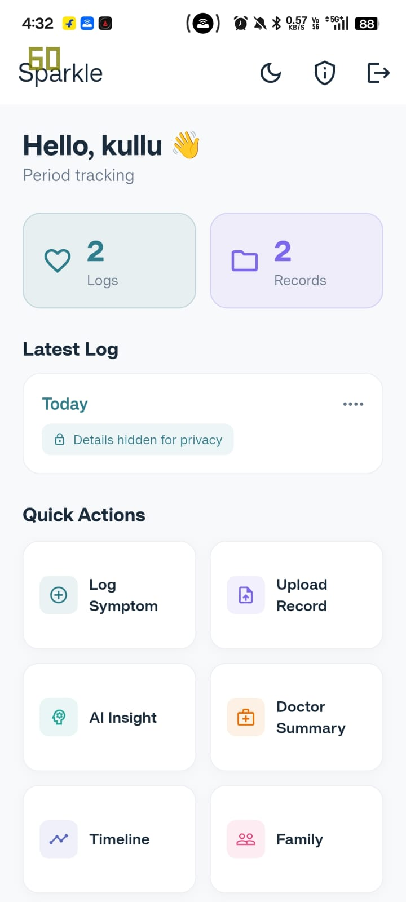
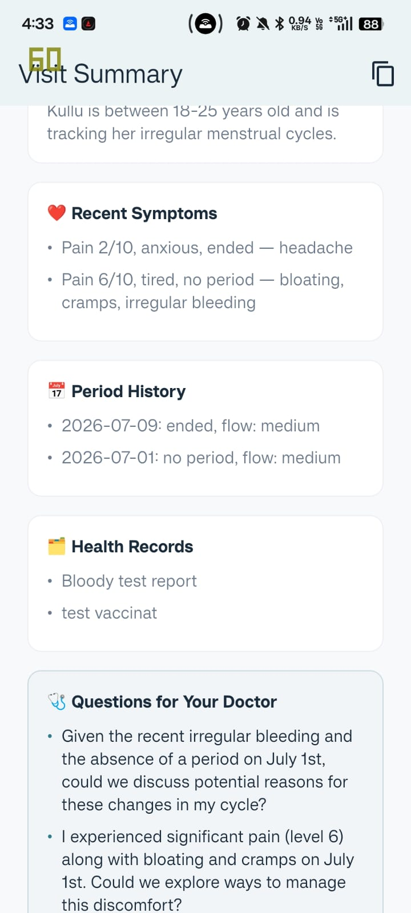
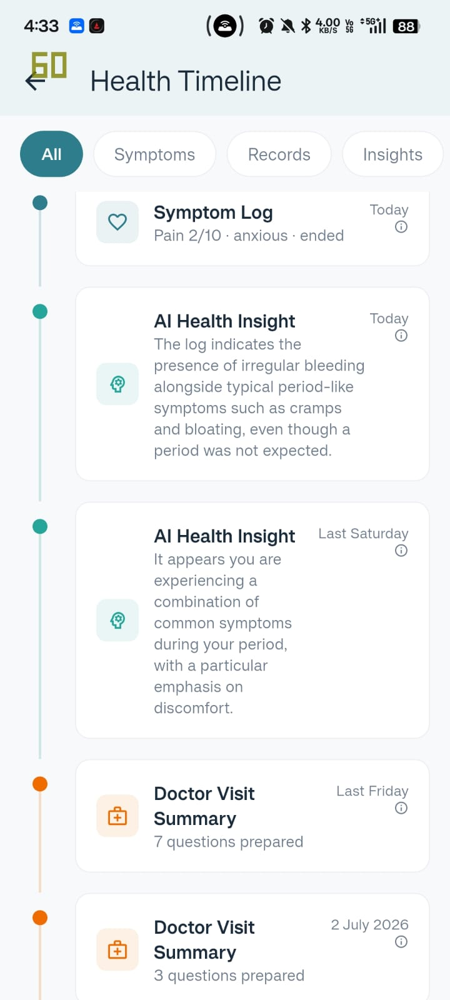
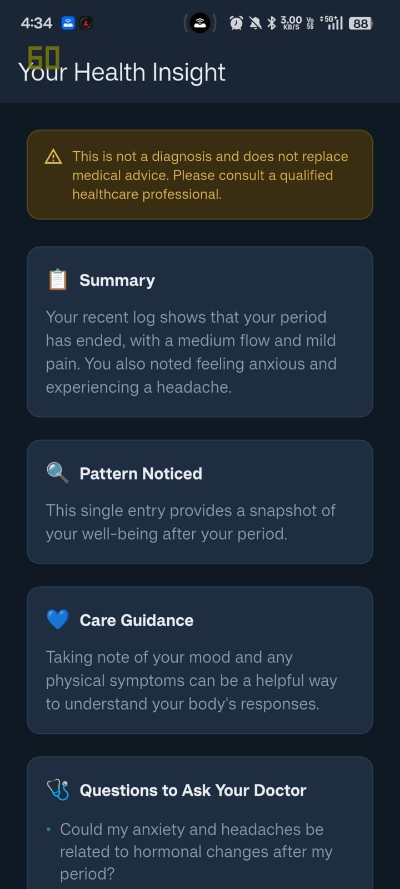
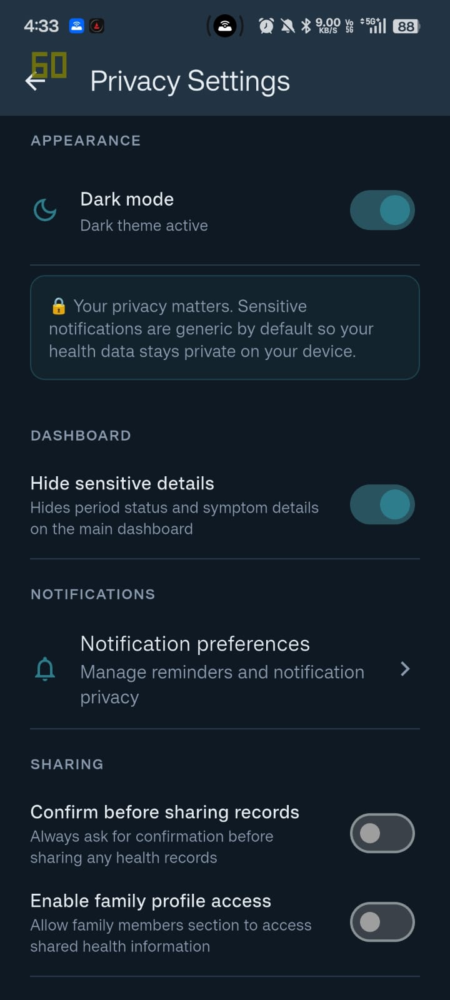
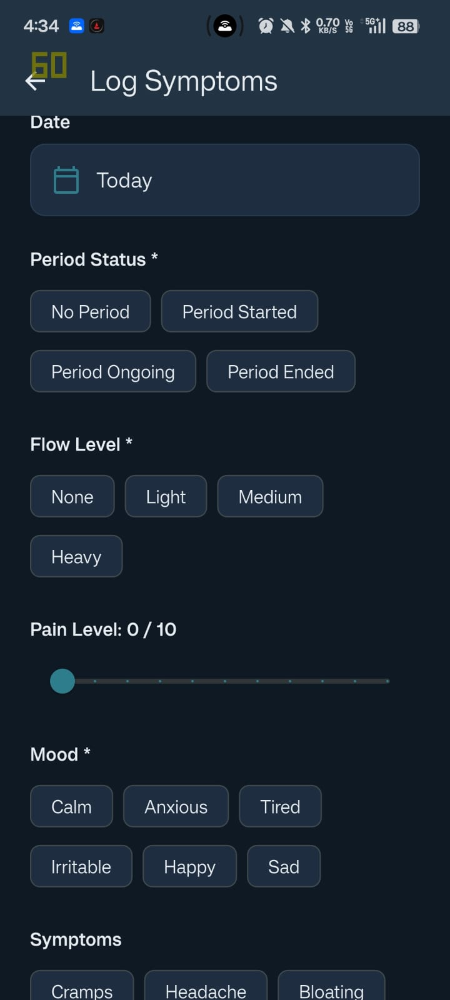
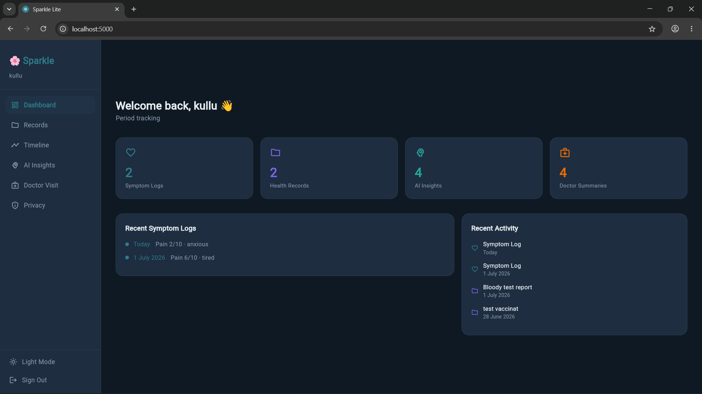
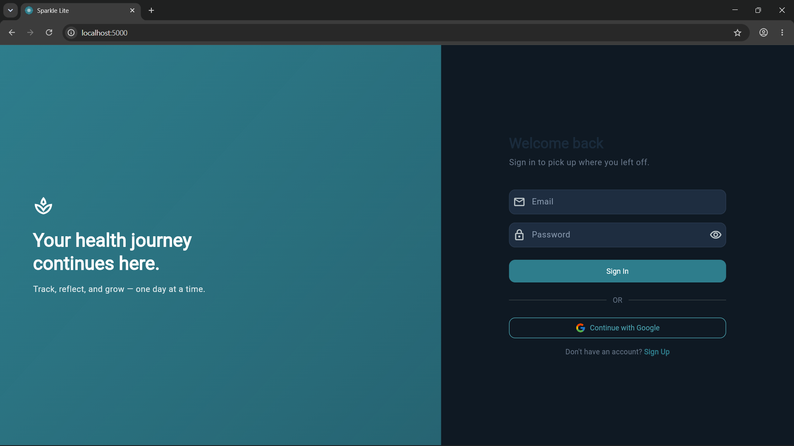
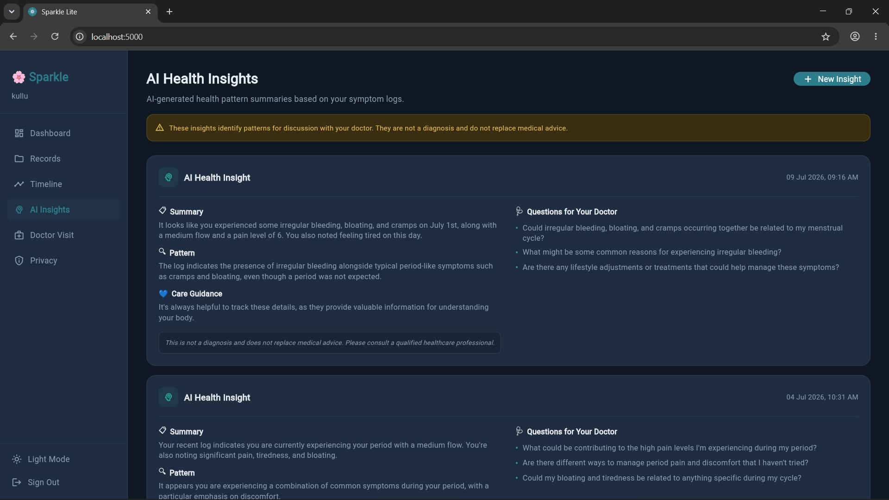

# 🌸 Sparkle — Women & Family Health Companion

A simplified but functional Flutter health companion app built as a take-home assignment for Earth On Sky (EOS / Zoom My Life). Sparkle helps users manage their health journey in one place — privately, calmly, and across both mobile and web.

**Live Web Demo:** https://sparkle-lite-523e6.web.app  
**GitHub:** https://github.com/harshyadavDeveloper/sparkle_lite  
**Android APK:** Available in [GitHub Releases v1.0.0](https://github.com/harshyadavDeveloper/sparkle_lite/releases/tag/v1.0.0)

---

## 📋 Project Overview

Sparkle Lite is a cross-platform Flutter application targeting women and family health management. The app allows users to:

- Create a private health profile
- Track period and gynaecology-related symptoms
- Upload and manage health records
- View a unified personal health timeline
- Receive AI-powered health insights via Gemini 2.5 Flash with mock logic fallback
- Prepare a doctor visit summary with copy, download, and share options
- Manage privacy and notification preferences
- Add and manage family member profiles with health notes
- Use the experience on both Android and web

---

## 📸 Screenshots

<table>
  <tr>
    <td align="center"><b>Mobile · Light</b></td>
    <td align="center"><b>Mobile · Light</b></td>
    <td align="center"><b>Mobile · Light</b></td>
  </tr>
  <tr>
    <td></td>
    <td></td>
    <td></td>
  </tr>
  <tr>
    <td align="center">Dashboard</td>
    <td align="center">Symptom History</td>
    <td align="center">Timeline</td>
  </tr>
  <tr>
    <td align="center"><b>Mobile · Dark</b></td>
    <td align="center"><b>Mobile · Dark</b></td>
    <td align="center"><b>Mobile · Dark</b></td>
  </tr>
  <tr>
    <td></td>
    <td></td>
    <td></td>
  </tr>
  <tr>
    <td align="center">Dashboard · Dark</td>
    <td align="center">AI Insight · Dark</td>
    <td align="center">Doctor Summary · Dark</td>
  </tr>
  <tr>
    <td align="center"><b>Web</b></td>
    <td align="center"><b>Web</b></td>
    <td align="center"><b>Web</b></td>
  </tr>
  <tr>
    <td></td>
    <td></td>
    <td></td>
  </tr>
  <tr>
    <td align="center">Web Dashboard</td>
    <td align="center">Records Manager</td>
    <td align="center">Timeline</td>
  </tr>
</table>

---

## 🛠 Tech Stack

| Layer            | Technology                                                               |
| ---------------- | ------------------------------------------------------------------------ |
| Framework        | Flutter 3.35.7                                                           |
| Language         | Dart                                                                     |
| State Management | Provider                                                                 |
| Routing          | Navigator 2.0                                                            |
| Authentication   | Firebase Auth (Email/Password + Google Sign-In)                          |
| Database         | Cloud Firestore                                                          |
| File Storage     | Mock implementation (see Known Limitations)                              |
| AI Engine        | Gemini 2.5 Flash (`gemini-2.5-flash:generateContent`) with mock fallback |
| HTTP Client      | Dio                                                                      |
| Local Storage    | SharedPreferences                                                        |
| Hosting          | Firebase Hosting                                                         |
| Date Formatting  | smart_date_formatter (pub.dev)                                           |
| CI/CD            | GitHub Actions                                                           |

---

## 🌿 Flutter Version

```
Flutter 3.35.7 • channel stable
Framework • revision adc9010625
```

---

## ⚙️ Setup Instructions

### Prerequisites

- Flutter 3.35.7 or higher
- Dart SDK ^3.9.2
- Android Studio or VS Code
- A Firebase project (see Firebase Setup below)

### Clone and Install

```bash
git clone https://github.com/harshyadavDeveloper/sparkle_lite.git
cd sparkle_lite
flutter pub get
```

### Firebase Setup

1. Create a Firebase project at [console.firebase.google.com](https://console.firebase.google.com)
2. Enable **Authentication** → Email/Password and Google Sign-In
3. Enable **Cloud Firestore** in test mode
4. Run `flutterfire configure` to generate `firebase_options.dart`
5. Add your Android SHA-1 fingerprint to Firebase project settings:

```bash
cd android && ./gradlew signingReport
```

6. Download and replace `android/app/google-services.json`
7. For Google Sign-In on web, add your hosting URL to authorized origins in Google Cloud Console → APIs & Services → Credentials

### Firebase Security Rules

Copy the rules from `firestore.rules` in the repository root and publish via Firebase Console → Firestore → Rules.

---

## 📱 How to Run Mobile

```bash
flutter run
```

Ensure a device or emulator is connected.

---

## 🌐 How to Run Web

```bash
flutter run -d chrome --web-port 5000
```

Port 5000 is required for Google Sign-In to work locally. The web version automatically shows the desktop dashboard layout with sidebar navigation.

---

## 🧪 How to Run Tests

```bash
# Run all tests
flutter test

# Run specific test file
flutter test test/data/models/symptom_log_test.dart
```

### Test Coverage

**Unit Tests:**

- `SymptomLog` model — serialization, optional fields, pain level bounds
- `HealthRecord` model — serialization, optional fields, valid record types
- `UserProfile` model — serialization, optional conditions and medications
- `PrivacySettings` model — default values, generic notifications ON by default
- `FirebaseAuthService` — sign up, sign in, sign out, auth state changes (via firebase_auth_mocks)
- Dio client — request/response interceptors, retry logic, error handling

**Widget Tests:**

- `LoginScreen` — renders correctly, empty validation, invalid email format, short password, valid form passes
- `AddSymptomScreen` — form renders, required chip validation, period status/flow/mood required
- `HealthRecordsScreen` — empty state text and emoji, FAB visible, loading indicator, error state with retry

---

## 🏗 Architecture

The project follows a **feature-first folder structure** with clear separation of concerns:

```
lib/
  core/
    constants/       → App-wide enums and string constants
    theme/           → AppTheme, light and dark themes
    routing/         → Navigator 2.0 router and route constants
    utils/           → Logger, validators, helpers
    widgets/         → Shared reusable widgets
  features/
    auth/            → Login, signup, onboarding, AuthProvider
    profile/         → Health profile setup, ProfileProvider
    dashboard/       → Mobile dashboard, web dashboard
    symptom_tracker/ → Add/edit/delete logs, SymptomProvider
    records/         → Upload/edit/delete records, HealthRecordProvider
    timeline/        → Unified timeline screen
    ai_insight/      → Gemini AI engine, mock fallback, AiInsightProvider
    doctor_visit/    → Doctor summary, DoctorSummaryProvider
    privacy/         → Privacy settings, PrivacyProvider, notification preferences
    family/          → Family member management with health notes
  data/
    models/          → SymptomLog, HealthRecord, AiInsight, etc.
    repositories/    → Firestore CRUD abstraction per feature
    services/        → FirebaseAuthService, GeminiAiService, MockAiEngine
  main.dart
```

Business logic lives exclusively in Provider classes and Repository classes. Widgets contain zero business logic — they call Provider methods and render state.

---

## 🔄 State Management — Why Provider

Provider was chosen over Riverpod, BLoC, or GetX for the following reasons:

- **Production-proven:** Used in a live travel app serving 5,000+ monthly active users at current employer (Bizzmirth Holidays), where it handles offline-first architecture with Isar database
- **Appropriate complexity:** The app's state is feature-scoped with no complex cross-feature reactive chains — Provider handles this cleanly without boilerplate overhead
- **Explicit and readable:** Every state change is traceable through `notifyListeners()` calls, making code review straightforward
- **Team-friendly:** Provider's simplicity makes onboarding new developers faster than Riverpod or BLoC

Each feature has its own `ChangeNotifier` provider. All providers are registered at the `MaterialApp` level and bootstrapped from the dashboard on login.

---

## 🗄 Data Model Explanation

### Firestore Collection Structure

```
profiles/{userId}
symptomLogs/{userId}/logs/{logId}
healthRecords/{userId}/records/{recordId}
aiInsights/{userId}/insights/{insightId}
doctorSummaries/{userId}/summaries/{summaryId}
familyMembers/{userId}/members/{memberId}
privacySettings/{userId}
notificationPreferences/{userId}
```

All data is scoped to `userId` — no user can access another user's data. Family member health data is stored in a completely separate subcollection from personal gynaecology data. They never mix.

### Key Models

**SymptomLog** — date, periodStatus, flowLevel, painLevel (0–10), mood, symptoms (List), notes (optional)

**HealthRecord** — title, recordType, recordDate, doctorName (optional), fileUrl, localFilePath (session-only), notes (optional)

**AiInsight** — summary, possiblePattern, careGuidance, doctorQuestions (List), disclaimer (always non-diagnostic)

**PrivacySettings** — `useGenericNotificationText` defaults to `true`, `requireConfirmationBeforeSharing` defaults to `true`, `hideSensitiveDashboardDetails` defaults to `false`

**FamilyMember** — name, relationship, ageRange, conditions (List), medications (List), doctorName, doctorContact, bloodGroup, notes

---

## 🤖 AI Health Insight Engine

The AI health insight feature uses **Gemini 2.5 Flash** (`gemini-2.5-flash:generateContent`) as the primary engine, with a local rule-based mock engine as fallback when the API is unavailable.

### Gemini Integration

Requests are made via Dio with retry logic and structured prompts that enforce non-diagnostic language. The prompt explicitly instructs Gemini to:

- Never diagnose conditions
- Frame all responses as educational and supportive
- Always include a disclaimer
- Suggest doctor questions rather than conclusions

### Mock Fallback Rules

| Condition                         | Insight Generated                                     |
| --------------------------------- | ----------------------------------------------------- |
| Pain level 8+                     | Suggest discussing severe pain with a doctor          |
| Heavy flow + dizziness note       | Show stronger care guidance                           |
| Irregular bleeding                | Suggest tracking dates and preparing doctor questions |
| Anxious mood across multiple logs | Suggest discussing emotional wellbeing                |
| Multiple logs, no major symptoms  | Show pattern summary                                  |
| No symptoms                       | Show gentle wellness summary                          |

All responses — from both Gemini and mock engine — include a non-diagnostic disclaimer and suggested doctor questions. The AI response never uses language like "You have PCOS", "You are pregnant", or "You do not need a doctor."

---

## 🔒 Privacy Considerations

Privacy is a first-class concern throughout the app, with all flags actively enforced in the UI:

- **Generic notifications by default** — `useGenericNotificationText` defaults to `true`. Notifications show "You have a health reminder" instead of specific health details. Toggling this off is an explicit user choice.
- **Dashboard privacy mode** — when `hideSensitiveDashboardDetails` is enabled, the recent log card on the dashboard shows a locked state instead of mood, symptoms, and pain level. Takes effect immediately without restart.
- **Confirmation before sharing** — when `requireConfirmationBeforeSharing` is enabled, copy, download, and share actions on doctor summaries show a confirmation dialog before proceeding. Enforced at the UI level.
- **Sensitive fields optional** — known conditions, medications, and notes are never required at any point
- **Family data separation** — family member records are stored in a completely separate Firestore subcollection. The two datasets never merge or cross-reference.
- **Privacy settings persistence** — stored in both SharedPreferences (instant local read on app start) and Firestore (cross-device sync). No app restart needed for changes to take effect.

---

## 🌐 Web Dashboard

The web version uses a completely separate layout from mobile — not a stretched mobile screen. It includes:

- Sidebar navigation with 6 sections
- Summary stat cards in a horizontal row
- Records manager with sortable table view
- Timeline with type icons and date columns
- AI insights with two-column card layout showing summary and doctor questions
- Doctor visit summaries with full question lists
- Privacy settings with two-column toggle layout

Automatically shown when running on web (`kIsWeb` detection in `main.dart`).

---

## ⚠️ Known Limitations

**1. File Upload (Firebase Storage)**
Firebase Storage requires the Blaze (pay-as-you-go) billing plan. To keep the project entirely on the free Spark plan, file upload uses a mock implementation that stores a reference URL in Firestore (`mock://health_records/{userId}/{fileName}`). In production, replacing the mock with real Firebase Storage upload requires a single method change in `HealthRecordRepository.uploadFile()`.

Image previews work during the current app session using the local file path. On app restart, metadata persists in Firestore but the local preview is no longer available.

**2. Offline Cache**
Isar local database offline caching was scoped out due to time constraints. The architecture is designed for it — repositories are abstracted so an Isar layer can be inserted between the UI and Firestore without changing any Provider or widget code. This is the same offline-first pattern used in production at Bizzmirth Holidays (Isar + Provider, serving 5,000+ monthly active users).

**3. Push Notifications**
Notification preferences are stored in Firestore and SharedPreferences with the generic text setting enforced. Actual push notification delivery via Firebase Cloud Messaging is not implemented — this is a UI and data layer only.

**4. Google Sign-In SHA-1**
Google Sign-In requires the debug SHA-1 fingerprint of the development machine to be registered in Firebase. When testing on a different machine, add its SHA-1 via Firebase Console → Project Settings → Android App → Add fingerprint.

---

## 🔀 Trade-offs

**1. Provider over Riverpod**
Riverpod offers better testability and compile-time safety. Provider was chosen for production familiarity and lower boilerplate. For a larger team or longer-lived codebase, Riverpod would be the preferred choice.

**2. Navigator 2.0 over go_router**
Navigator 2.0 gives full control over the navigation stack and handles web URL routing natively. go_router would be simpler to configure but Navigator 2.0 was chosen for existing production experience and its native web deep-linking support.

**3. Mock file upload over real Firebase Storage**
Real Firebase Storage requires the Blaze billing plan. Mock implementation was chosen to keep the project entirely free while demonstrating the correct architecture. The abstraction means switching to real storage is a one-method change.

**4. Dio over http package**
Dio was chosen over the standard `http` package for its built-in retry logic, request/response interceptors, and structured logging. This is particularly valuable for Gemini API calls in a health app where failed requests need to be retried gracefully and responses need to be logged for debugging.

**5. SharedPreferences + Firestore dual storage for privacy preferences**
Privacy toggle states are stored in both SharedPreferences (instant read on app start, no async wait) and Firestore (cross-device persistence). This means privacy settings take effect immediately on every app launch without a network request, while still syncing across devices on login.

**6. Gemini 2.5 Flash with mock fallback**
A real AI API was chosen over pure mock logic to demonstrate production-ready thinking. The mock fallback ensures the feature remains functional when the API is unavailable or rate-limited, which is critical for a health app where users expect consistent behaviour.

**7. Feature-first over layer-first architecture**
Feature-first was chosen because it scales better as features grow, makes code review easier since all related code is co-located, and is easier to hand off to a new developer who can work on a single feature without navigating the entire codebase.

---

## 🚀 What I Would Do Next in Production

- Replace mock file upload with real Firebase Storage (single method change in repository)
- Add Isar offline cache layer between repositories and Firestore — architecture already supports this
- Implement real push notifications via Firebase Cloud Messaging
- Add biometric authentication for app lock
- Add PDF export for doctor visit summary (`pdf` package already evaluated)
- Expand AI prompt engineering for more nuanced Gemini responses
- Add full string localization — `smart_date_formatter` already handles 16 languages for dates
- Add end-to-end encryption for sensitive health records

---

## 🧪 CI/CD

GitHub Actions workflow runs on every push and tag:

- Runs `flutter analyze` and `flutter test` on every push
- On tag push (`v*`): builds Android APK, builds Flutter web, deploys to Firebase Hosting, creates GitHub Release with APK and web build as assets

---

## 📦 Open Source Integration

This project integrates two packages authored or contributed to by the developer:

**[smart_date_formatter](https://pub.dev/packages/smart_date_formatter)** — A Flutter DateTime toolkit published on pub.dev with 16-language localization, auto-refreshing widgets, and streak analytics. Used throughout Sparkle for human-readable relative dates ("Today", "Yesterday", "Monday") with exact date tooltips on demand. 25 GitHub stars.

**[rename_app](https://pub.dev/packages/rename_app)** — A pub.dev package for renaming Flutter apps across all platforms in a single command. The developer is an active contributor. Used to rename the app to "Sparkle" across Android, iOS, web, macOS, Windows, and Linux.

---

## 👨‍💻 Developer

**Harsh Yadav**  
Flutter Developer — 3+ years production experience  
GitHub: [@harshyadavDeveloper](https://github.com/harshyadavDeveloper)  
pub.dev: [smart_date_formatter](https://pub.dev/packages/smart_date_formatter) • [fl_pretty_charts](https://pub.dev/packages/fl_pretty_charts)

---

_Built with 🌸 for Earth On Sky / Zoom My Life take-home assignment_
